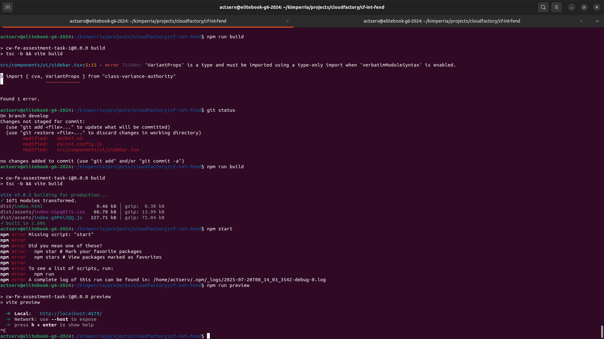

# Changes Made

## General Improvements

**Added `.nvmrc` file**

- Issue: specify project node environment
- Fix: Locked development Node version to v24.4.1 for stability

**Modify index.html**

- Issue: Typo in `<title>` tag ("Wortionary" instead of "Worctionary")
- Fix: Corrected typo to align with brand consistency

## Component Refactors & Code splitting

`App.tsx` => `Header.tsx`, `Herosection(BoxArea97.tsx)`, `TagList.tsx`

- Issue: Implement best practice, seperation of convers for clean git history and scalability in the future.
- Fix: Extract each component to its own file

### Header component

- Issue: styling did not match Figma
- Fix: updated styling per design spec

### Hero section

- Issue: styling did not match Figma
- Fix: modify UI and styling to match the design
- Subcomponents:
  - Split BoxArea97 and BoxArea108 into reusable pieces

### TagList

- Issue: code split Taglist component to a reusable and stand alone
- Fix:
  - Clean up App.tsx and make TagList a stand alone reusable component.
  - Added type safety using TypeScript interface

### Tag

- Issue: Rendering logic used non-unique key (tag)
- Fix: Switched to array index as key to maintain uniqueness
- Mod: Update style to match the requirements on figma

### Eslint and TypeScript Fixes

#### Build Failure

- Issue: ESLint build failed due to react-refresh/only-export-components error triggered by unused useSidebar hook
- Fix:
  - Updated the `class-variance-authority` import on the sidebar AI-generated component
  - Added a temporary ESLint override since the Sidebar component is not yet active in the app.
  - Context: Build fails prematurely due eslint configuration to attached is a screenshot 
    - The useSidebar hook is defined in the same file as the Sidebar component for convenience during prototyping. ESLint's react-refresh/only-export-components rule is disabled locally and should be refactored if Sidebar is used or the hook grows in complexity.
    - When we eventually use the Sidebar component or hook:
      - Move the hook to hooks/useSidebar.ts or lib/useSidebar.ts
      - Remove the ESLint override

### UI Notes

- Avatar Image: The image specified in Figma for the nav avatar was not downloadable or available in provided assets
- Fallback: Left the component as-is with fallback to the first letter
